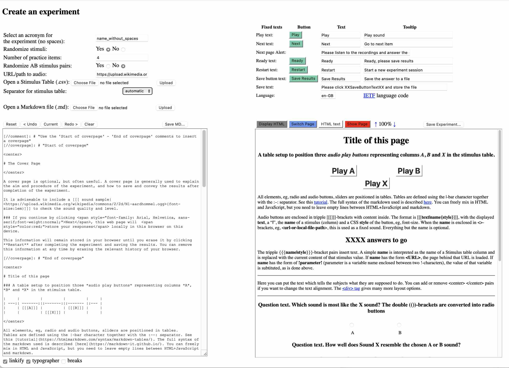

<H1 style='text-align: center'> akoúste</H1>

Version 2 [^1]

[Try the demo](https://robvanson.github.io/akouste/akousteCreate.html)

## Client-side listening experiments in the browser

The *akoúste* project aims to provide tools for simple, adaptable listening experiments for situations where the use of a dynamic host server storing and serving the speech and collecting the responses over the internet is unpractical or unwanted, e.g., due to privacy concerns. *akoúste* Pages can be used both on desk/laptops and on mobile devices, with and without a network connection.

*akoúste* Experiments can as easily be run off thumbdrives, or local hard drives, with all data kept locally, as they can be run from a web server. Submission of results is under the control of the subject doing the experiment. The whole experiment is run inside the browser and intermediate results are stored in the browser's local storage. After completing the experiment, the subject can download the results in text format which can be submitted to the experimenter.

## What is needed

Bill of Materials

- Stimuli
- A table listing which stimuli should be presented at each turn
- An experiment web page that presents the stimuli to the listeners and collects their responses

To create a listening experiment, access to [*akousteCreate.html*](https://robvanson.github.io/akouste/akousteCreate.html) is needed. This access does not have to be local, the [*akoúste* github pages](https://robvanson.github.io/akouste/) will do. For a real experiment, stimulus audio files are required, preferably in a local folder. The stimulus files can be accessed locally, or remotely over https. Any audio format that can be played by the web browsers of choice can be used.

For stimulus lists, *akousteCreate* will read .csv tables (comma-separated-values) as can be derived from most spreadsheet, database, or statistics applications. Columns in these tables should have names in a header row. The table should contain columns that contain the names of the stimulus files. The tables can store any other information that is convenient in other columns. It is OK if there is only a single column with stimulus file names. The path or URL to the folder that contains the audio stimulus files can be supplied separately, so it is not necessary to write out the path to each individual stimulus.

The visual layout and text of the web page that presents the experiment is written in an easy to use Markdown format in an edit frame in *akousteCreate.html*. The web version is visible in another frame on the same page. The full page can be tested in a functional popup window (**Show Page**). As most, if not all, browsers block access to local files on the user's computer from an in-browser generated web page, it is not possible to test local audio in the popup window. 

In our demonstrations, we use web URLs to demonstrate the full functionality. But when designing and testing an experiment using local audio files, the experiment page should be saved to the local drive (**Save Experiment...**) after setting the (relative) path to the audio folder, and opened from there. It is a good idea to save the markdown of an experiment too, using **Save MD...**, as it will be needed to debug or adapt the experiment.

Examples (random audio examples courtesy of [Wikimedia Commons](https://commons.wikimedia.org/wiki/Main_Page)):

- [AB comparison](https://robvanson.github.io/akouste/akousteCreate.html?ExperimentAcronym=ABexample)

- [ABX comparison](https://robvanson.github.io/akouste/akousteCreate.html?ExperimentAcronym=ABXexample)

- [Transcription](https://robvanson.github.io/akouste/akousteCreate.html?ExperimentAcronym=Transcribe)

- [SToPS (Sunderland
  Tracheoesophageal Perceptual Scale)](https://robvanson.github.io/akouste/akousteCreate.html?ExperimentAcronym=SToPS) [^2]   
  with fancy formatting

- Minimalistic [Audiotest experiment](https://robvanson.github.io/akouste/akousteCreate.html?ExperimentAcronym=Audiotest)    
  test full chain from local stimulus files to audible audio
  
  For browser specific information, see [Browser settings](#Browser-settings-and-compatibility) below.

## What you get

*akousteCreate* creates a self contained web page that can run the experiment and can be distributed together with the stimuli, if the stimuli are local. Contrary to what the name *web page* suggests, the experiment web page works completely off-line. Internet is only used when stimuli are not available locally and for the SHA digest checks, if needed, and this can be stored locally when desired. [*akousteCreate.html*](https://robvanson.github.io/akouste/akousteCreate.html) accesses a markdown converter online. [^3]

The web page optionally starts with a cover page which can contain all the information and instructions for the subjects. The stimulus list will be contained in the web page, but a suitable *.js* file with stimuli can be supplied that will read a new stimulus list. The subject can pace through the experiment and pause as they see fit. All information needed to pick up the experiment at a later time is stored inside the browser. After the last answer is given, the subject is offered the option to save the results in a text file (*.txt*). After that, the data in the browser can be deleted by clicking the **Restart** button.

## What you do *not* get

Although *akoúste* stores progress of the experiment in the local browser, absolutely ***no*** information is send out. Even the results of the experiment will be stored locally in a text file, and only if the user saves them. The results only leave the computer when the user conveys them by email or DM to the addressee, or, if desired, print the results and send them by surface mail.

## Under the hood

The *akoúste* experiments are constructed as a self-contained web page in plain HTML + CSS + Javascript. Experiments can be constructed in a [self contained Web page editor](https://robvanson.github.io/akouste/akousteCreate.html). The basis is a markdown text file using [markdown-it](https://github.com/markdown-it/markdown-it) ([demo](https://markdown-it.github.io/)). The markdown file will have experimental settings and the stimulus table appended in a comment section at the end. This information can be edited directly in the markdown file, but care should be taken as the formatting requirements for settings and stimuli are rather strict. The markdown file is a full description of the experiment and is all that is needed to edit or recreate the experiment. It is advised to save the markdown of an experiment, using **Save MD...**, as it will be needed to debug or adapt the experiment. The markdown file can be edited in any markdown aware editor and opened again in *akousteCreate.html* using **Open a Markdown file (.md)**.

Stimulus tables are incorporated into the experiment web page from CSV tables uploaded with the **Open a Stimulus Table** selection and upload buttons. Stimuli can be presented with fixed or dynamic practice items, in pseudo-randomized order, with pseudo-randomized pairs if two sounds are to be presented. The answers are added as seperate columns to the stimulus table. Stimulus tables can contain more information than just the stimuli which makes the results tables directly usable for analysis.

The tasks can be any number of stimulus sounds, A, AB, ABX testing, and responses can be any number of Likert scales with any number of choices as well as any number of computerized Visual Analogue Scales (VAS) and text entry fields, or any mix of these.

It is possible to create *\<experimentname\>\_stimuluslist.js* files to use different stimulus tables for the same experiment page.

## User Interface

The editor is a web page with on top two blocks of experiment settings. Top-left are settings relevant to the stimulus presentation. Top-right the texts used for the buttons and information to steer the subjects in their responses and experiment.

At the bottom are two frames. To the left is the Markdown edit window. The text and audio presented during the experiment can be edited and formated here. To the right is a Display/HTML frame. It shows the rendered HTML created from the Markdown (**Display HTML**) or the HTML source text (**HTML text**). This is just the HTML created from the Markdown. This is not functional. The HTML source text can be edited directly. However, this will disappear easily, so any changes not transfered to the markdown should be saved using the **Save Experiment...** button.

*User Interface of akousteCreate.html*

When the **Show Page** button is clicked, a popup with a functioning page will appear. This shows the experiment as it appears to the actual user. This page is fully functional. However, if the page refers to stimuli on the local computer, almost all browsers will block the audio. It generally only works for audio files accessed through *HTTPS://* URLs.

When the experiment is ready to be deployed, it can be saved using the **Save Experiment...** button on top of the HTML window. If work has to be interrupted before it is finished, or when the final experiment is ready, the Markdown window can be saved using the **Save MD...** button. The resulting Markdown file will contain all information needed to continue later or to add changes. It can be opened again with the **Open a Markdown file** selection/upload button.

## Stimuli

Stimuli are organized as tables with named columns and each row containing the information of a single presentation. Necessary information contained in each row are the stimulus files (audio) or values (text fields) to be presented, and, for the analysis, the experimental conditions they represent. 

The stimulus tables can be constructed in a simple spreadsheet table and saved as a CSV (comma separated values) file. For practical reasons, it is advisable to use the ; as a separation symbol (semicolon separated values) as *akoúste* cannot handle comma-separated values that themselves contain comma's. 

| A                      | B                   | X                         | LangA       | LangB       | LangX        |
| ---------------------- | ------------------- | ------------------------- | ----------- | ----------- | ------------ |
| 6/62/De-Aluminium.ogg  | e/e7/Fr-bordure.ogg | d/db/En-uk-illustrate.ogg | German (De) | French (Fr) | English (En) |
| 2/2d/Nl-aardhommel.ogg | 8/8e/Or-ଅନୁଶୀଳନ.oga | d/da/L1188694-F1.oga      | Dutch (Nl)  | Oriya (Or)  | Arabic (Ar)  |

*A simple stimulus table from the ABX example. Note the audio files need a common base URL: `https://upload.wikimedia.org/wikipedia/commons/`.*

Stimulus tables are uploaded by **Open a Stimulus Table (.csv):**. *akoúste* is designed to work with local stimulus files. However, modern web browsers prohibit mixing the access of web URLs and local files. Therefor, it is not possible to access local audio files from *akousteCreate.html*. The examples given all use web URLs to access sound files. They are practical to debug the experiment. When the experiment is completed and ready for execution, the stimulus table can be uploaded and the experiment saved with **Save Experiment...**. If the file paths are entered correctly, the experiment file can be opened in a browser and the experiment will run with the local files (see [Browser settings](#Browser-settings)). There is a trick to save an experiment with URL stimuli and then save a *.js* file with the local file stimulus list next to it, the *Audiotest* example uses this trick. When started, the experiment will load the stimuli in the *.js* file. The button to downoad this *.js* stimulus table, **Download stimuli** will appear after uploading the *.csv* table.

Stimulus files can be entered as full or relative paths or full URLs. When a comon base folder path or URL path is given in the **URL/path to audio:** parameter, eg, *./Stimuli/*, only the varying part of the path or URL has to be placed in the stimulus table.

*akoúste* Ignores all columns in the stimulus table that are not mentioned in the experiment. The output of the experiment is the original stimulus table, with columns added for answers, number of the stimulus during presentation, and AB switch if applicable. Note that the output table has the rows in the order of presentation with practice rows pre-pended if present.

This approach was chosen to simplify analysis as all data needed for the analysis can be placed in the stimulus table and will remain associated with the correct stimuli even after randomization. Note that the name or code of the subject is *not* known to *akoúste* and not stored in the answers. There is a separate script that can add this to the answers, *ProcessResults.html*.

As the resul files have to be communicated by the subjects themselves and might become corrupted during transport, there is an option to add a error check after each answer row (see [The settings](#The-settings)). This can be checked by *ProcessResults.html* too.

## Markdown

The user facing part of the experiment is a web-page. The text and layout of this page are designed using an adapted Markdown language, [markdown-it](https://markdown-it.github.io/). The markdown library is obtained from [https://cdn.jsdelivr.net/npm/markdown-it@14.1.0/dist/](https://cdn.jsdelivr.net/npm/markdown-it@14.1.0/dist/), *markdown-it.min.js*. This file can also be downloaded and stored locally in the same folder as *akousteCreate.html* when convenient. It will then be loaded automatically if the link is not available.

A new experiment requires a lot of text writing. The editor of *akouseCreate.html* is not equiped for serious word processing. It is best to create the initial markdown document with a fully featured markdown editor and later upload it to *akouseCreate.html*. There are a large number of fully featured markdown desktop editors available, eg, [PanWriter](https://panwriter.com/), [Mark Text](https://www.marktext.cc/), or [Visual Studio Code](https://code.visualstudio.com/docs/languages/markdown/) with [Markdown Extensions](https://marketplace.visualstudio.com/items?itemName=yzhang.markdown-all-in-one), as well as browser plugins, eg, [Markdown Editor](https://chromewebstore.google.com/detail/ekdcaddpmiodcipjfmffhhefijpdckaf) for Chrome.

*akoúste* Adds everal constructs to the [markdown-it](https://markdown-it.github.io/) format to ease the placement of active elements for the experiments. Some of these constructs use the pipe symbol, **\|**. This symbol can cause problems when editing markdown files in WYSIWYG markdown editors as they also represent column boundaries in tables. Such problems can often be prevented by prepending a backslash character before the pipe symbol, ie, \\\|. You cannot use backslash-\ itself nor backslash "escape" sequences before any other symbol inside the special akoúste constructs. If even the use of \\| doesn't help, a different broken pipe symbol, ¦ \&#166\;, can be used instead. This symbol generally has no keyboard equivalent so it should be used as a last resort.

### Stimulus related constructs

Two constructs are defined to present stimulus sounds and texts to subjects:

- \[\[\[text\|name\{style\}\]\]\] creates an audio button showing *text* in *style*, playing the audio files mentioned in column *name*.   
  For instance, \[\[\[Speaker A\|A\{font-style: italic;\}\]\]\] would show a button with the text *Speaker A* in italic and play the current stimulus in the column labeled *A* of the stimulus table.
- \{\{\{name\|style\}\}\} creates a text field showing the string in column *name* in *style*.   
  For instance, \{\{\{LangA\|font-style: italic;\}\}\} would show the text in *italic* of the current stimulus in the column labeled *LangA* of the stimulus table.

*Note: Stimulus related constructs are not functional in the editor preview window of akousteCreate.html. The text stimulus {{{name|style}}} constructs might, therefore, be invisible in the preview window.*

*All* sounds have to be played before the subject can proceed to the next stimulus.

Three constructs are defined to collect subject evaluations based on answers in the questionnaire:

- A row of \(\(\)\) is translated to a row of radio buttons. All radio buttons on a line will be combined in a single radio-button row. It is best to put the individual buttons and their labels into a table for consistent placement (see example markdown files).
- \>\>----------\<\< (10 -dashes or more) will be transformed into a visual analogue slider.
- \<\<\| text \|\>\> becomes a text input field with the *text* as default value.

*All* questions have to be answered (changed) before the subject can move to the next stimulus. Answers will be added to the Stimulus table with each question getting their own column, tagged Answer1, Answer2..., numbered in order of the questions on the page.

### Extensions

Extensions of the \[\[\[text\|name\{style\}\]\]\] audio button and \{\{\{name\|style\}\}\} text constructs have been added to simplify some tasks. In these constructs, **URL** means *http(s)://* style links as well as local files *./path/file.ext*. Using stored local files is preferable as it is robust to network downtime and [link-rot](https://en.wikipedia.org/wiki/Link_rot).

These extensions present fixed content and are intended to present examples or explanations. Subjects do not have to interact with them to proceed to the next stimulus.

- \[\[\[ text |\<URL\>\\{style\}\]\]\] inserts an audio button that will play the sound at the **URL** (\< \> are obligatory). 
- \{\{\{\<URL\>\|style\}\}\} insert an *iframe* with the page at the **URL**.
- \{\{\{!parameter!\|style\}\}\} insert the text value of the internal variable **parameter**. This is used, e.g., to display the remaining number of stimuli in the examples.

### The cover page

A general experiment starts with an explanation of the aims of the experiment, what is expected from the subject, and instructions on how to complete the task of the experiment. To this end, a *cover page* can be demarcated in the markdown. 

A cover page is started by a single line that says:

> \[//coverpage\]: \# "Start of coverpage"

After entering the page, the cover page is closed with a single line:

> \[//coverpage\]: \# "End of coverpage"

This will translate to an HTML file that contains two \<div\>'s, one for each page, the cover page and the experiment page. Only one of these \<div\>'s will be visible at any time. When the experiment file is loaded, only the cover page will be visible. The experiment only starts when the subject clicks on the **Next** button.

### The settings

The markdown file is designed to be a self-contained complete representation of the experiment. For that reason, internal data of the experiment and the stimulus table are automatically appended to the markdown. These data are formatted in ways that make them "invisible" to the markdown. The data are in text form and can be edited directly in the markdown. However, the format is rather strict so editing could lead to unexpected behavior. In normal use, there would be no need to edit the settings directly. It suffices to save the markdown with the **Save MD...** button. 

*akoúste* has over a dozen of settings to manage each experiment. They can be set in the akousteCreate page. They are stored at the bottom of the markdown file. The settings start after the line:

> \[//comment\]: \# "These are internal parameters for the experiment and visible texts not in this Markdown"   
> \[//comment\]: \# "----------"

Each setting has the form:

> \[//label\]: \# "key:value"

Where the label indicates what kind of setting it is. 

The settings end with:

> \[//comment\]: \# "----------"

A number of characters could interfere with the rendering of the HTML web page or execution of the experiment. The characters \| $ % @ " ' \` \< \> \\ ( \) + will be removed from settings parameters, labels, and tooltips. If they should be displayed, use the relevant HTML encodings (preferably using named entities, eg, \&quot\; for ").

There are two hidden parameters that have no associated input fields: **body.style** and **addDigest**. 

**body.style** is used to change the full page style. For instance:

> \[//parameter\]: \# "body.style: font-family: Arial, Helvetica, sans-serif;background-color:GhostWhite;"

Changes the font to *sans-serif*, preverably *Arial*, or *Helvetica*. It also changes the background color of the page.

**addDigest**, value **true** or **false**, is used to add a digest to the answers for error detection, a chained SHA256 digest per row in hexadecimal. 

> \[//parameter\]: # "addDigest:true"

As the answers can be communicated to the experimenter using any communication channel, it can be prudent to check whether the answer files might have been corrupted during transmission. The answers of each line can be checked against the digest numbers at the end of each table row using the **ProcessResponse.html** web application of *akoúste*.

### The stimulus table

The stimulus table is stored below the settings area in the markdown file. This area can be edited directly, but that should rarely be necessary. When a *.csv* file is uploaded, the contents automatically replace the existing data in the markdown file. It suffices to save the markdown with the **Save MD...** button.

The definition of the stimulus table starts with:

> \[//comment\]: \# "These are stimuli for this experiment"   
> \[//comment\]: \# "----------"

Then follows a line with the header of the table. For example:

> \[//stimulus0\]: \# "A,B,X,LangA,LangB,LangX"

This line says that the table has columns named *A*, *B*, *X*, *LangA*, *LangB*, and *LangX*

Then follow the rows of the table. Each row has the form:

> \[//stimulus1\]: \# "6/62/De-Aluminium.ogg,e/e7/Fr-bordure.ogg,d/db/En-uk-illustrate.ogg,German (DE),French (FR),English (EN)"

This line gives the names of three *.ogg* audio files and the names of the respective languages as an example. Note that the rows of the stimulus table all have the label \[//stimulus1\]. They are *not* numbered.

The stimulus table ends with:

> \[//comment\]: \# "----------"

The stimulus table can be edited directly in the markdown file. The format is rather strict with comma-separated values. All comma's and " '-quotes are replaced and stored as their \&\#\<ASCII\>; values, ie, \&\#44;, \&\#34;, and \&\#39;. Conversions are automatically back and forth between the internal stimulus table and the markdown file. If a quote should simply be displayed in the HTML page, use \&quot\; for " and \&apos\; for '.

## Browser settings and compatibility

Web browsers implement security measures to prevent web sites from acccessing each other's data or the clients's local data, both for reading and writing. These [Same-origin policies](https://en.wikipedia.org/wiki/Same-origin_policy) affect how *akoúste* can implement experiments. It means that the demonstration page (**Show Page**) in the *akousteCreate.html* environment cannot use locally stored audio, only audio accessed through web links.

For the final experiments to work with local audio in a web browser, *JavaScript* and *Third-party cookies* should be allowed (Chrome, Edge and derived browsers), or *cross-site tracking* should be allowed (ie, *not* prevented, Safari). Firefox and derived browsers seem to work in most settings. Using *akoúste* with Internet Explorer (IE) does not work. 

To check local audio access, *Audiotest_experiment.html* has been added with associated stimulus files in the *Stimulus* subfolder of *akoúste*. When loaded from a web link (URL), *Audiotest_experiment.html* will use the default web based audio. When loaded from a local file, it will read a stimulus list from *Audiotest_stimuluslist.js*, which uses local audio files.

Browser compatibility was tested with all interfering browser protections switched off. Ad-blockers, anti-tracking settings, and blocking third-party cookies interfered with the experiments in most browsers. The browsers were tested using the [GitHub pages](http://robvanson.github.io/akouste) examples of the experiments as well as by loading the local *Audiotest_experiment.html* webpage in the downloaded *akoúste* package.

*Table 1: Browsers that run local akoúste experiment file with local audio.*

|         | Windows | Mac | Linux | Android |
| -------:|:-------:|:---:|:-----:|:-------:|
| Firefox | +       | +   | +     | - $^*$  |
| Safari  |         | +   |       |         |
| Chrome  |         | +   | +     | +       |
| Edge    | +       | +   |       | +       |
| Vivaldi | +       | +   | +     | +       |
| Opera   | +       | +   | +     | +       |

$^*$ Cannot load local file

&nbsp;

*Table 2: Browsers that run GitHub stored akoúste experiment with GitHub stored audio.*

|         | Windows | Mac | Linux | Android |
| -------:|:-------:|:---:|:-----:|:-------:|
| Firefox | +       | +   | +     | +       |
| Safari  |         | +   |       |         |
| Chrome  |         | +   | +     | +       |
| Edge    | +       | +   |       | +       |
| Vivaldi | +       | +   | +     | +       |
| Opera   | +       | +   | +     | +       |

&nbsp;

*Table 3: Browsers that run local akousteCreate.html file with **Show Page** and web audio.*

|         | Windows | Mac | Linux | Android $^§$ |
| -------:|:-------:|:---:|:-----:|:------------:|
| Firefox | +       | +   | +     | -            |
| Safari  |         | +   |       |              |
| Chrome  |         | +   | +     | -            |
| Edge    | +       | +   |       | -            |
| Vivaldi | +       | +   | +     | -            |
| Opera   | +       | +   | +     | -            |

$^§$ ***Show Page*** *and* ***Save Experiment...*** *do not work on Android*

&nbsp;

*Table 4: Browsers that run GitHub Pages akousteCreate.html with **Show Page**.*

|         | Windows | Mac | Linux | Android |
| -------:|:-------:|:---:|:-----:|:-------:|
| Firefox | +       | +   | +     | +       |
| Safari  |         | +   |       |         |
| Chrome  |         | +   | +     | +       |
| Edge    | +       | +   |       | +       |
| Vivaldi | +       | +   | +     | +       |
| Opera   | +       | +   | +     | +       |

---------

[^1]: Version 1 has moved to [Github akouste-v1](https://github.com/robvanson/akouste-v1)  
[^2]: [Guidance for SToPS (PDF)](https://eprints.leedsbeckett.ac.uk/id/eprint/4126/3/Guidance%20notes%20for%20SToPS.pdf)  
[^3]: The converter [*markdown-it.min.js*](https://cdn.jsdelivr.net/npm/markdown-it@14.1.0/dist/) can be stored locally if desired.
